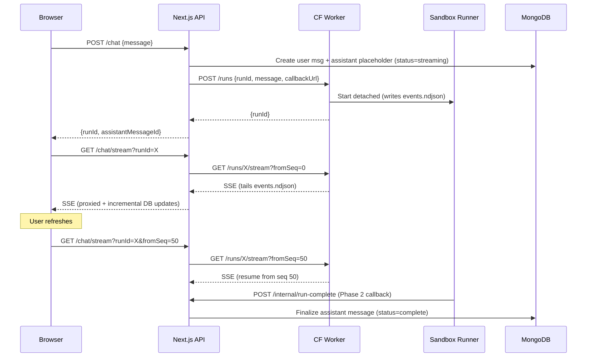

# Resumable Chat Streaming with Guaranteed Persistence

## Problem

- Chat execution is coupled to a single HTTP connection
- Browser refresh loses the in-flight assistant response
- Persistence only happens at stream end, so disconnects orphan runs

## Architecture Overview



## Implementation

### 1. Prisma Schema ([prisma/schema.prisma](prisma/schema.prisma))

Add run tracking fields to `ProjectMessage`:

```prisma
enum MessageStatus {
  streaming
  complete
  error
}

model ProjectMessage {
  id        String        @id @default(auto()) @map("_id") @db.ObjectId
  projectId String        @db.ObjectId
  project   Project       @relation(fields: [projectId], references: [id], onDelete: Cascade)
  role      MessageRole
  content   String
  runId     String?       // Links assistant msg to a run
  status    MessageStatus @default(complete)
  streamSeq Int           @default(0)  // Last persisted seq for incremental updates
  error     String?
  createdAt DateTime      @default(now())
  updatedAt DateTime      @updatedAt

  @@map("project_messages")
}
```

### 2. Runner Changes ([agent-worker/runner/run_chat.ts](agent-worker/runner/run_chat.ts))

When `RUN_ID` env is set, switch to event-log mode:

- Write events to `.runs/<runId>/events.ndjson` (NDJSON format)
- Write `meta.json` on completion
- **Phase 2**: Make HTTP callback to `CALLBACK_URL` with final content
- Handle SIGTERM gracefully (write error event + callback)

Event types:

- `{"seq":1,"type":"delta","text":"..."}`
- `{"seq":N,"type":"session_id","sessionId":"..."}`
- `{"seq":N,"type":"done"}`
- `{"seq":N,"type":"error","error":"..."}`

### 3. Worker Endpoints ([agent-worker/src/index.ts](agent-worker/src/index.ts))

Already scaffolded, needs completion:

- `POST /v1/projects/:projectId/runs` - Start run (pass `CALLBACK_URL`, `CALLBACK_SECRET` to runner)
- `GET /v1/projects/:projectId/runs/:runId/stream?fromSeq=N` - Resumable SSE via `tail -f`
- `GET /v1/projects/:projectId/runs/:runId/status` - Read meta.json + last event
- `POST /v1/projects/:projectId/runs/:runId/cancel` - Kill process, write error event

### 4. Next.js API Routes

**Update** `POST /api/projects/:projectId/chat` ([src/app/api/projects/[projectId]/chat/route.ts](src/app/api/projects/[projectId]/chat/route.ts)):

- Create user message (existing)
- Create assistant placeholder with `status=streaming`, `runId`
- Call Worker `POST /runs` with `callbackUrl` pointing to internal endpoint
- Return `{runId, assistantMessageId}` (JSON, not SSE)

**New** `GET /api/projects/:projectId/chat/stream`:

- Proxy Worker `/runs/:runId/stream?fromSeq=N`
- Incrementally update assistant message content (batch every ~500ms or 10 events)
- Support `Last-Event-ID` header for resume

**New** `POST /api/projects/:projectId/chat/cancel`:

- Call Worker `/runs/:runId/cancel`
- Update assistant message `status=error`

**New (Phase 2)** `POST /api/internal/run-complete`:

- Validate `X-Callback-Secret` header
- Idempotent: skip if message already `status=complete`
- Update assistant message with final content, `status=complete`
- Update project `claudeSessionId`

### 5. UI Changes ([src/components/projects/project-view/components/ChatPanel.tsx](src/components/projects/project-view/components/ChatPanel.tsx))

Two-step flow:

1. `POST /api/.../chat` → get `{runId, assistantMessageId}`
2. Open `EventSource` to `/api/.../chat/stream?runId=...`

On mount/refresh:

- Check if last assistant message has `status=streaming`
- If so, auto-reconnect using its `runId` and `streamSeq`

New UI states:

- While streaming: disable send, show "Agent is responding..." with **Stop** button
- Stop button calls `/chat/cancel`

### 6. Page/SSR Changes ([src/app/(authed)/projects/[projectId]/page.tsx](src/app/(authed)/projects/[projectId]/page.tsx))

Pass `status`, `runId`, `streamSeq` to `initialMessages` so the client knows if it needs to resume.

### 7. Phase 2: Guaranteed Persistence

**Runner callback** (in [agent-worker/runner/run_chat.ts](agent-worker/runner/run_chat.ts)):

- On completion, POST to `CALLBACK_URL`:
  ```json
  {
    "runId": "...",
    "projectId": "...", 
    "status": "complete",
    "content": "full assistant text",
    "sessionId": "..."
  }
  ```

- Retry 3x with exponential backoff on failure
- SIGTERM handler: write error event then attempt callback

**Stuck-run watchdog** (lightweight):

- In `/runs/:runId/status`, if `meta.status=running` but no events for 5+ minutes and process not running (`ps -p`), mark as error
- Phase 2 callback ensures DB gets updated even without polling

## File Touchpoints Summary

- `prisma/schema.prisma` - Add MessageStatus enum, runId/status/streamSeq/error fields
- `agent-worker/runner/run_chat.ts` - Event-log mode + completion callback
- `agent-worker/src/index.ts` - Complete run endpoints, pass callback URL
- `src/app/api/projects/[projectId]/chat/route.ts` - Refactor to start-run flow
- `src/app/api/projects/[projectId]/chat/stream/route.ts` - New SSE proxy
- `src/app/api/projects/[projectId]/chat/cancel/route.ts` - New cancel route
- `src/app/api/internal/run-complete/route.ts` - New callback endpoint (Phase 2)
- `src/components/projects/project-view/components/ChatPanel.tsx` - EventSource + resume
- `src/components/projects/project-view/types.ts` - Add status/runId to Message type
- `src/app/(authed)/projects/[projectId]/page.tsx` - Pass new fields to initialMessages